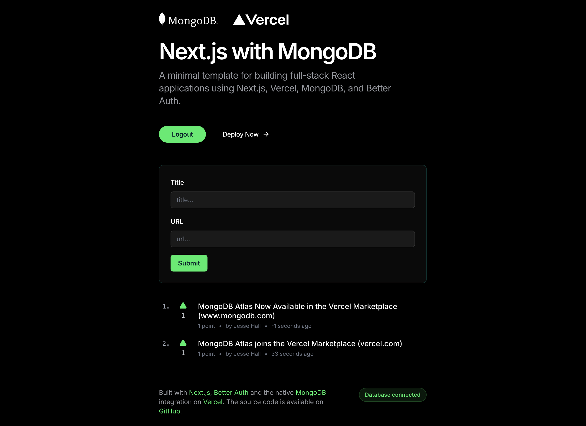

-> View demo: [news.mongodb.com](https://nextjs-news-template-mongodb.vercel.app/)

# Next.js with MongoDB and Better Auth

A modern full-stack template for building React applications using Next.js, MongoDB, and Better Auth for authentication. Features a Hacker News-style post submission and voting system with optimistic updates, server actions, and email/password authentication.

## Features

- **🔐 Authentication**: Email/password authentication with Better Auth
- **📝 Post System**: Hacker News-style post submission and voting
- **⚡ Optimistic Updates**: Real-time UI updates with React's useOptimistic
- **🎨 Modern UI**: Built with shadcn/ui and Tailwind CSS
- **📱 Responsive Design**: Mobile-first design with dark mode support
- **🗄️ MongoDB Integration**: Native MongoDB driver with optimized queries
- **🔄 Server Actions**: Form handling without client-side API calls
- **📊 Real-time Status**: Database connection monitoring
- **🚀 Production Ready**: TypeScript, ESLint, and Vercel deployment optimized

## Getting Started

Click the "Deploy" button to clone this repo, create a new Vercel project, setup the MongoDB integration, and provision a new MongoDB database:

[](https://vercel.com/new/clone?repository-url=https%3A%2F%2Fgithub.com%2Fmongodb-developer%2Fnextjs-news-template-mongodb&project-name=mongodb-news-nextjs&repository-name=mongodb-news-nextjs&demo-title=MongoDB%20%26%20Next.js%20Auth%20Starter%20Template&demo-description=A%20minimal%20template%20for%20building%20full-stack%20React%20applications%20using%20Next.js%2C%20Vercel%2C%2C%20Better%20Auth%20and%20MongoDB.&demo-url=https%3A%2F%2Fnews.mongodb.com&demo-image=https%3A%2F%2Fnews.mongodb.com%2Fog.png&products=%5B%7B%22type%22%3A%22integration%22%2C%22integrationSlug%22%3A%22mongodbatlas%22%2C%22productSlug%22%3A%22atlas%22%2C%22protocol%22%3A%22storage%22%7D%5D&env=BETTER_AUTH_SECRET&envDescription=Generate%20a%20random%20secret%20by%20clicking%20here%20%E2%86%92%20&envLink=https%3A%2F%2Fgenerate-secret.vercel.app%2F32) 

## Local Setup

### Installation

Install the dependencies:

```bash
npm install
```

### Development

#### Create a .env file in the project root

```bash
cp .env.example .env
```

#### Configure environment variables

Update the `.env` file with your configuration:

```txt
# MongoDB connection string from Atlas Dashboard
MONGODB_URI=mongodb+srv://<username>:<password>@<cluster-url>/<database>?retryWrites=true&w=majority
MONGODB_DB=better-auth

# Better Auth configuration
BETTER_AUTH_URL=http://localhost:3000
BETTER_AUTH_SECRET=your-secure-secret-key-here-minimum-32-characters

```

#### Setup database indexes (optional for production)

```bash
npm run setup-indexes
```

#### Start the development server

```bash
npm run dev
```

Open [http://localhost:3000](http://localhost:3000) with your browser to see the result.

## Tech Stack

- **Framework**: [Next.js 15](https://nextjs.org) with App Router
- **Database**: [MongoDB](https://www.mongodb.com?utm_campaign=devrel&utm_source=third-party-content&utm_medium=cta&utm_content=template-nextjs-news-mongodb&utm_term=jesse.hall) with native Node.js driver
- **Authentication**: [Better Auth](https://better-auth.com) with email/password
- **Styling**: [Tailwind CSS](https://tailwindcss.com) with [shadcn/ui](https://ui.shadcn.com)
- **Forms**: [React Hook Form](https://react-hook-form.com) with [Zod](https://zod.dev) validation
- **Icons**: [Lucide React](https://lucide.dev)
- **Notifications**: [Sonner](https://sonner.emilkowal.ski)
- **Deployment**: [Vercel](https://vercel.com)

## Project Structure

```
├── app/                    # Next.js App Router
│   ├── api/auth/          # Better Auth API routes
│   ├── login/             # Login page
│   ├── signup/            # Signup page
│   └── page.tsx           # Home page
├── components/            # React components
│   ├── ui/               # shadcn/ui components
│   ├── PostItem.tsx      # Individual post with voting
│   ├── PostListServer.tsx # Server-side post list
│   ├── PostSection.tsx   # Post section wrapper
│   └── ...               # Other components
├── lib/                  # Core utilities
│   ├── auth.ts          # Better Auth configuration
│   ├── auth-client.ts   # Client-side auth methods
│   ├── mongodb.ts       # Database connection
│   ├── posts.ts         # Post data functions
│   ├── actions.ts       # Server actions
│   └── schemas.ts       # Zod validation schemas
└── scripts/             # Utility scripts
    └── setup-indexes.mjs # Database index setup
```

## Key Features Explained

### Authentication System
- **Email/Password**: Secure login with email and password
- **Form Validation**: Password requirements and email validation
- **Session Management**: Secure session handling with MongoDB storage
- **User Profiles**: User account management with Better Auth

### Post Management
- **Real-time Voting**: Optimistic UI updates using React's `useOptimistic`
- **Server Actions**: Form submissions without client-side API calls
- **Caching**: Strategic caching with Next.js `unstable_cache` and revalidation
- **Pagination**: URL-based pagination with smooth navigation

### Modern React Patterns
- **Server Components**: SEO-friendly server-side rendering
- **Client Components**: Interactive elements with proper hydration boundaries
- **Suspense**: Loading states for better user experience
- **Form Validation**: Type-safe forms with React Hook Form and Zod

## Learn More

To learn more about the technologies used in this template:

- [Next.js Documentation](https://nextjs.org/docs) - learn about Next.js features and API
- [Better Auth Documentation](https://better-auth.com/docs) - authentication and session management
- [MongoDB Documentation](https://www.mongodb.com/docs/?utm_campaign=devrel&utm_source=third-party-content&utm_medium=cta&utm_content=template-nextjs-news-mongodb&utm_term=jesse.hall) - database features and APIs
- [shadcn/ui Documentation](https://ui.shadcn.com) - component library and design system
- [Tailwind CSS Documentation](https://tailwindcss.com/docs) - utility-first CSS framework

## Deploy on Vercel

Commit and push your code changes to your GitHub repository to automatically trigger a new deployment.
